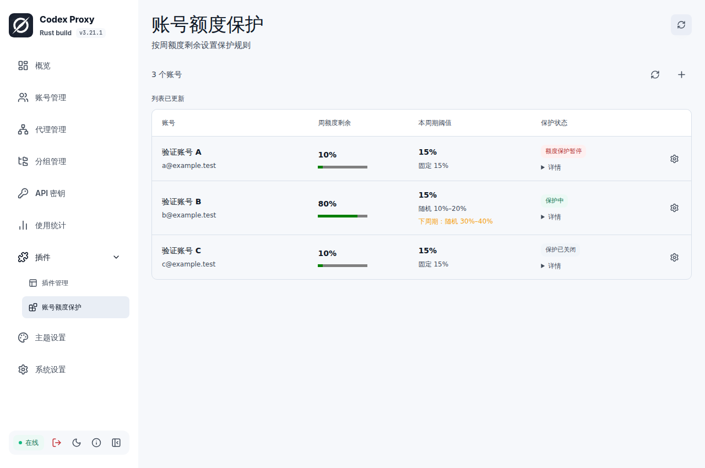

# CPR 账号额度保护

为账号设置周额度剩余阈值。比如设为 15%，剩余低于 15% 时拦截新请求；CPR 取得恢复后的额度数据后，自动放行。

插件只读取 CPR 已有额度，不主动向上游查额度。账号无需加入拼车。



## 功能

- 按账号设置固定阈值，或设置区间、每个周额度周期随机抽取一次
- 支持 1%～100% 的整数；随机区间包含两端，允许上下限相同
- 剩余恰好等于阈值时放行
- 刷新页面、重启插件和同周期停启保护，不会重新抽取
- 固定数值修改立即生效；模式切换、随机区间修改在下个确认的周期生效

## 安装

支持 **CPR >=3.21.1、<4.0.0**，不包含 4.0.0。选择与 CPR 服务器架构对应的 Linux x86_64 或 ARM64 安装包。

1. 从 [Releases](https://github.com/Ming-321/CPR-account-quota-guard/releases) 下载 `.tar.gz` 和对应 `.sha256`，校验后在 CPR 插件管理中上传安装
2. CPR 会自动启用默认配置，安装后先停用；在绑定设置中把 **“插件失败时”改为“交给后续处理”**，保存后再启用
3. 打开“账号额度保护”，点击右上角 **+**，选择账号、设置阈值并保存

故障策略优先保证可用性：插件不可用时，CPR 可继续处理请求，这期间保护可能失效。正常触发的额度拒绝仍会生效，不会被该设置绕过。取消、超时或已调用下游的请求仍可能失败。

## 使用限制

**号池不保证换号。** 假如 A 已触发保护、B 还有额度，只要 CPR 继续选中 A，请求就可能连续失败。插件在选号后拦截，不会停用 A、将 A 移出号池或代替 CPR 切换到 B。

- 只使用 Codex 主周额度，不以 5 小时额度代替；不修改账号原生启用状态
- 首次没有有效额度，或随机模式尚不能确定周期时，暂时放行
- 额度读取失败或没有有效数据时，保留上次判断；周期尚未确认时只收紧、不放宽保护，到预计重置时间也不会自行恢复
- 提前重置和漂移需要新的周窗口事实才能确认，仅账号总体更新时间变化不算证据
- 空闲后额度可能滞后，并发和在途请求还会继续消耗，不能保证精确保留相应余额
- 只保护经过 CPR 的新请求，不中断已开始的回答；关闭保护或停用插件可解除本插件限制
- 客户端可能只看到 CPR 的 `403 / policy_denied`，具体账号状态在插件页面查看

## 开发

Rust 1.97.0、Node 24、pnpm 12.6.0。SDK 和打包 CLI 固定到 CPR v3.21.1，UI 使用官方 v0.3.0。

```bash
cargo test --locked
cargo clippy --all-targets --locked -- -D warnings
pnpm --dir frontend install --frozen-lockfile
pnpm --dir frontend lint
pnpm --dir frontend test
pnpm --dir frontend build
cargo build --release --locked
```

打包及隔离验证见 [开发说明](docs/development.md)。实际运行验证使用 CPR v3.21.1 / Linux ARM64 和合成上游；x86_64 完成原生构建与测试。兼容范围不代表未来所有 3.x 都已实测。

[Apache-2.0](LICENSE) · [复用说明](NOTICE)
